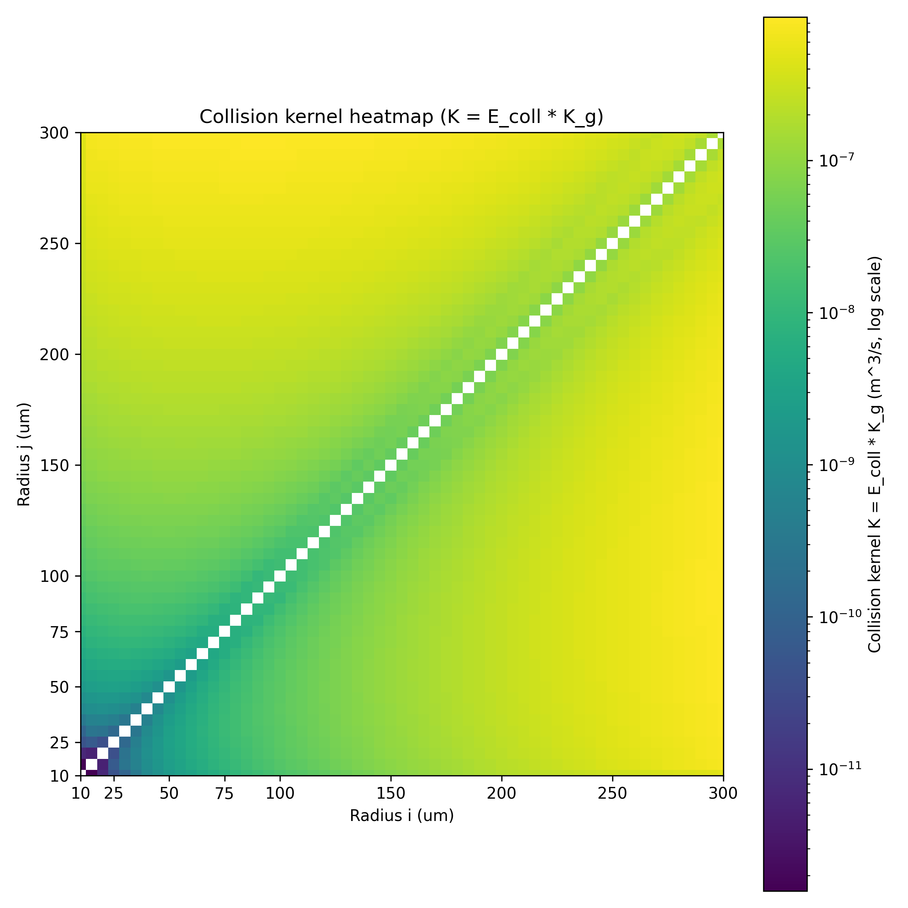

# KernelPlot
This repository was created to collect data for quickly handling a variety of collision, coalescence, and collision-breakup kernels and efficiencies. Contributions from anyone are welcome.

## Quick look
This paper is very helpful for understanding the topic.

Liu, Y., Yau, M. K., Shima, S. I., Lu, C., & Chen, S. (2023). Parameterization and explicit modeling of cloud microphysics: Approaches, challenges, and future directions. Advances in Atmospheric Sciences, 40(5), 747-790. DOI: [10.1007/s00376-022-2077-3](https://doi.org/10.1007/s00376-022-2077-3)

### Geometric kernel
Collision kernel for the case where particles are not affected by the surrounding medium.

$$
K_{geo}(r_j,r_k) = \pi (r_j + r_k)^2 |v_j - v_k|
$$

$v_j$ and $v_k$ are particle fall velocities. When it is reasonable to assume terminal fall speeds, the Beard (1976)[^1] formulation is commonly used.

[^1]: Beard, K. V. (1976). Terminal velocity and shape of cloud and precipitation drops aloft. Journal of Atmospheric Sciences, 33(5), 851-864. DOI: [10.1175/1520-0469(1976)033%3C0851:TVASOC%3E2.0.CO%3B2](https://doi.org/10.1175/1520-0469(1976)033<0851:TVASOC>2.0.CO;2)

### Gravitational kernel

### Saffman-Turner kernel